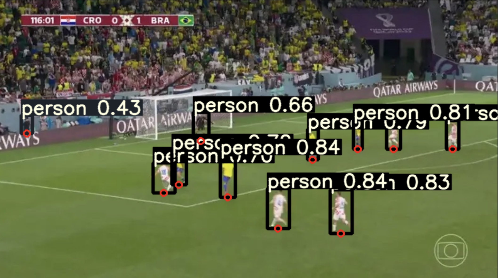
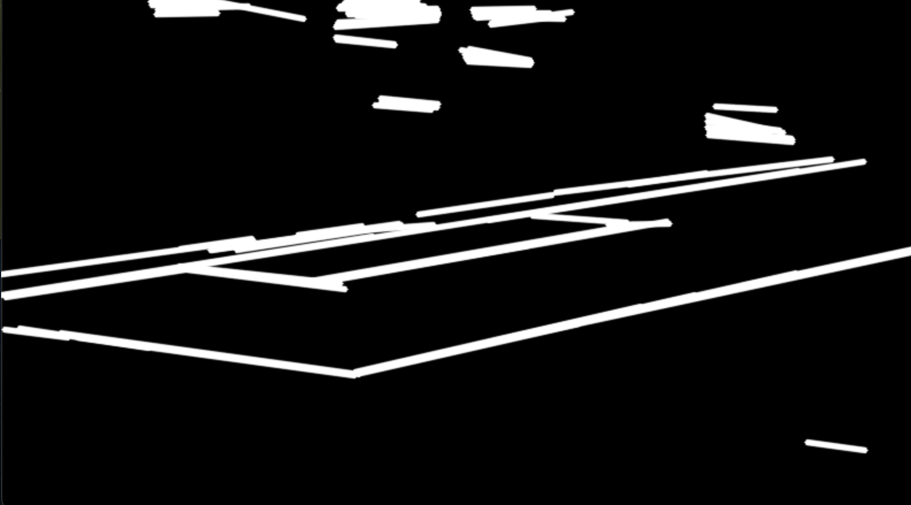
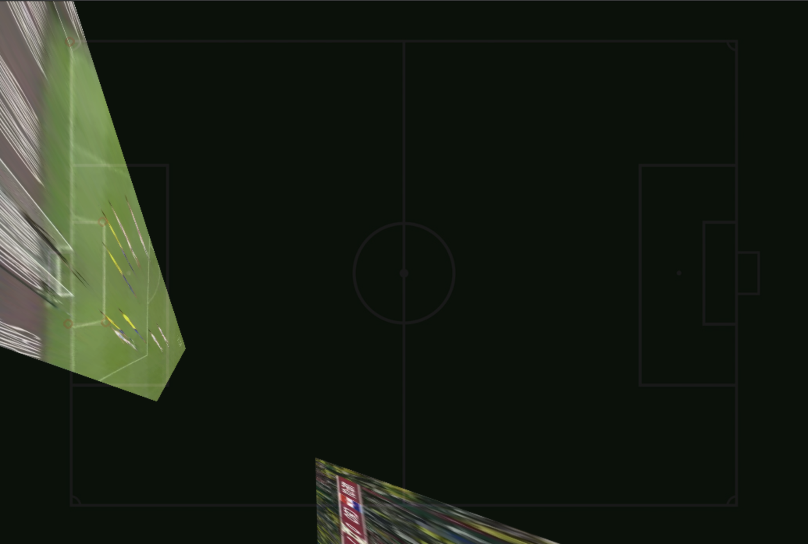
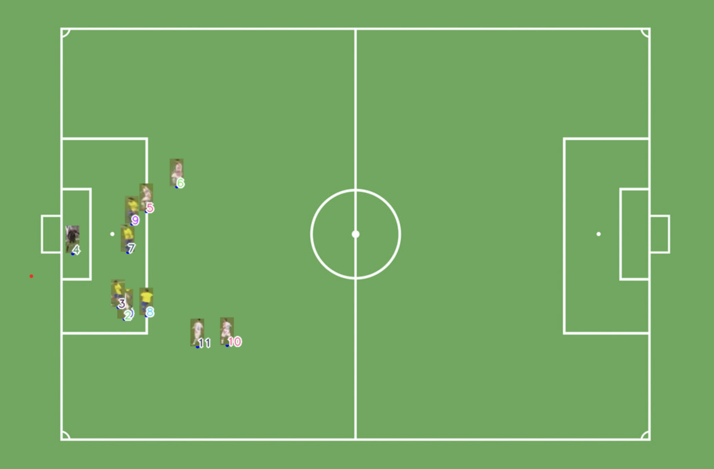

# Desafio

Neste desafio, você deve analisar um conjunto de fotos de um trecho de uma partida de futebol (disponibilizado em anexo) e capturar os jogadores em campo. Para alcançar esse objetivo, siga os passos abaixo:
1. Identifique os jogadores por meio de visão computacional, preferencialmente utilizando OpenCV.
2. Registre as posições dos jogadores em um mapeamento bidimensional (com coordenadas x e y).
3. Gere uma tabela contendo o ID do(s) jogador(es) e a posição de cada um dos atletas.

## Requisitos
* A implementação deve ser feita em Python.
* Utilize bibliotecas atuais, com as dependências ajustadas.
* Inclua a biblioteca OpenCV em sua implementação.
* Você pode escolher entre utilizar ou não bibliotecas como TensorFlow/Keras ou YOLO.
* É permitido usar um modelo já treinado.
* Por favor, descreva sua abordagem para resolver este desafio e forneça o código-fonte, juntamente com instruções detalhadas sobre como executá-lo.

# Solução
A solução tomou como base a sequencia indicada no desafio, sendo que a primeira etapa foi a identificação dos jogadores, a segunda a captura das posições e a terceira a geração da tabela com os dados. 

## Ambiente
Para a execução do projeto, foi utilizado o MacOS, com o Python 3.10.9, e as biliotecas presentes no arquivo `requirements.txt`.

Para facilitar a execução do projeto, foi criado um ambiente virtual, utilizando o [virtualenv], e instalado as dependências utilizando o [pip].

### Execução em ambiente virtual
Para executar o projeto em um ambiente virtual, é necessário instalar o [virtualenv], e então executar os seguintes comandos:

```bash
python3 -m venv env
source env/bin/activate
pip install -r requirements.txt
```

Após isso é necessário realizar o download da yolo na pasta do projeto.

```sh
git clone https://github.com/ultralytics/yolov5
cd yolov5
pip install -r requirements.txt
```


## Identificação dos jogadores
Para a identificação dos jogadores foi utilizado o modelo YOLOv3, que é um modelo de detecção de objetos, que foi treinado com o dataset COCO. O modelo foi treinado para identificar 80 classes de objetos, dentre elas, pessoas.

Foi possível perceber que de maneira geral, o modelo conseguiu identificar corretamente os jogadores, porém, em alguns casos, ele identificou objetos que não eram jogadores, como por exemplo, o juiz de linha, ou mesmo outras pessoas que estavam foram do campo.
Este problema pode ser resolvido facilmente após termos a tabela com os dados, pois podemos filtrar os dados e remover os jogadores que não estiverem dentro do campo.




Além disso, é possível utilizar a cor da camiseta para identificar jogadores de cada time, ou o juiz.

> Etapa disponível em: `python3 yol.py Teste_1.jpg`

##### Arquivo (resposta)
ps: Como o programa ainda está dividido em módulos, esta parte da solução gera atualmente o arquivo [[positions.txt]], que contém todos os jogadores encontrados, associados a um id e suas posições X e Y na imagem, no estilo
 ```csv
0 49 213
```


## Mapeamento dos jogadores
Primeiramente, com base nas bounding boxes geradas pelo modelo YOLOv3, foi possível identificar a posição dos jogadores em relação a imagem. Para isso, foi utilizado o centro inferior da bounding box, que é o ponto mais baixo do jogador (seus pés). Visto que este é provavelmente o ponto menos distorcido da imagem, e que a posição do jogador em relação a imagem é a mesma que a posição do jogador em relação ao campo.

### Estimativa de Homografia
Para identificar a posição dos jogadores em relação ao campo, seria necessário estimar a homografia entre a imagem e o campo.

#### Linhas principais do campo
Inicialmente realizei processamentos simples na imagem para destacar as linhas principais do campo.



> Etapa disponível em: `python3 lines.py Teste_1.jpg`

Para a estimativa de homografia, o desafio indicava uma rede neural já treinada, apresentada no artigo [narya], porém este projeto necessita de uma biblioteca chamada [mxnet], que não é compativel com MacOS.

Tentei utilizar outras abordagens, como a biblioteca [scikit-image], o método [RANSAC] e também o método de classificação [KNN], porém, nenhum deles foi capaz de identificar os pontos de interesse com precisão.
Imagino que com mais tempo, e um bom banco de dados de treinamento, seria possível obter bons resultados com uma [CNN] específica para este problema.

#### Possível rede

Para identificar a distorção da imagem de um campo de futebol, criaria uma rede neural convolucional (CNN). Vou descrever esta rede em [[#Próximas Etapas]]

#### Abordagem temporária

Como alternativa, resolvi utilizar por enquanto uma classificação manual, onde o usuário iria clicar nos pontos de interesse, e o programa iria calcular a homografia. Isto como uma solução temporária, até que eu consiga implementar uma solução mais robusta e automatizada.



O vídeo [[docs/manual.mov]] mostra o processo manual de estimativa de homografia.

> Etapa disponível em: `python3 manual_homography.py Teste_1.jpg`

##### Arquivo (resposta)
ps: Como o programa ainda está dividido em módulos, esta parte da solução gera atualmente o arquivo [[homography.txt]], que contém uma matriz 3x3 com os dados para conversão dos pontos da imagem atual para o campo visto de cima.

### Conversão de posições
Na sequencia, são utilizadas as respostas dos dois módulos anteriores (positions.txt e homography.txt) para realizar a conversão das posições dos jogadores na foto, para os mesmos no campo (visto de cima)



Perceba também que nesta etapa, já é possível facilmente remover a pessoa que estava fora do campo, simplesmente analisando a sua distancia para a borda da imagem.

> Etapa disponível em: `python3 convert.py`

O resultado, em formato de tabela, fica no arquivo [[valid_players.txt]]

O vídeo [[processo_completo.mp4]] contém o processo completo de execução dos módulos.

## Próximas Etapas

Minhas próximas etapas para tornar esta solução melhor seriam.

### Rede Neural para detecção de pontos de interesse no campo
Já que atualmente tenho que fazer esta parte na mão, criaria uma CNN para identificar os pontos.

1.  Camada de entrada: a imagem do campo de futebol (pre processada para aumentar a qualidade da estimativa da rede)
2.  Camadas convolucionais (provavelmente com filtros de tamanho 3x3 e função de ativação ReLU), além de camadas de max pooling (provavelmente com tamanho de janela 2x2). (provavelmente ir aumentando a quantidade de filtros conforme a profundidade da rede, já que o max_pooling iria ajudar a diminuir o tamanho da imagem)
3.  Após várias camadas convolucionais, usaria uma camada totalmente conectada com muitos  neurônios.
4.  Por fim, uma camada totalmente conectada com 8 neurônios, correspondendo às coordenadas x e y dos 4 cantos do campo.

A saída da rede será composta por 4 pontos, cada um indicando a posição xy de um dos cantos do campo (mesmo que o canto esteja fora da imagem). Para treinar a rede, podemos usar um conjunto de imagens de campos de futebol com diferentes graus de distorção, juntamente com as coordenadas dos cantos do campo em cada imagem. O objetivo da rede será aprender a mapear a imagem do campo de futebol para as coordenadas dos seus cantos, independentemente da distorção da imagem.

### Reidentificação de Jogadores
Caso as imagens sejam analisadas em vídeos, como proposto no artigo exemplo, precisaríamos de uma rede capaz de (dado frame anterior), reidentificar os ids dos jogadores para o proximo frame.
Não tenho certeza ainda de qual o melhor tipo de rede para isso, mas imagino que uma rede neural simples, que tenha como entradas as posições x,y e ids de jogadores do frame anterior, e as posicões x,y identificadas para o frame atual, possa retornar os ids para cada ponto.
Outras abordagens como KNN, ou até mesmo uma outra solução específica e de calculo de proximidade e vetores podem ser o suficiente para esta solução, mas como disse anteriormente, ainda não tenho certeza da melhor abordagem.

# Pergunta adicional:

Considerando que você terá cinco (5) meses para trabalhar neste projeto e que teremos um estagiário de Engenharia da Computação como integrante da equipe, descreva como você pretende organizar sua rotina de trabalho. Leve em consideração que sua interação com o estagiário também deve estar prevista neste processo.

Para organizar minha rotina de trabalho, eu seguiria os seguintes passos:

1.  Planejamento: Definir objetivos claros e factíveis para cada mês do projeto, criar um cronograma para cada mês e dividir as tarefas em pequenas etapas.
2.  Desenvolvimento e capacitação: Preparar um treinamento básico em Python e OpenCV para o estagiário, além de oferecer suporte técnico para que ele possa entender melhor o projeto e contribuir em algumas tarefas específicas.
3.  Acompanhamento e feedback: Revisar regularmente o progresso das atividades e dar feedback constante para a equipe em relação ao desempenho e ao cumprimento dos prazos estabelecidos.
4.  Gestão de projetos: Realizar reuniões semanais com a equipe para discutir o progresso do projeto, identificar possíveis desafios, encontrar soluções em conjunto, identificar possíveis riscos e elaborar um plano de contingência para agir rapidamente caso ocorram problemas.

Em relação ao estagiário, pretendo incluí-lo nas atividades do projeto desde o início, para que ele possa entender o contexto e contribuir com suas ideias e habilidades. Além disso, vou me certificar de que ele receba feedback regularmente, para que possa aprimorar suas habilidades e se tornar cada vez mais eficiente em suas tarefas. A ideia é que ele inicialmente atue com a criação de bancos de treinamento para as inteligências artificiais do projeto, classificando e anotando imagens que mais tarde serão utilizadas nas etapas de treinamento.

Por fim, não conheço ainda completamente o que já existe em desenvolvimento pela equipe, e quais as metas atuais do projeto, desta forma estou ciente de que estas etapas levantadas podem não ser as mais eficiente. Além disso, imprevistos podem acontecer durante o projeto, e estou preparado para adaptar minha rotina de trabalho e redefinir prioridades, se necessário.
